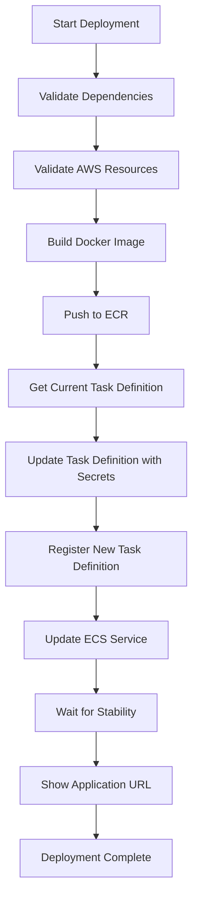

# React App ECS Deployment - Implementation Summary

## Overview

This document summarizes the changes made to enable the React frontend application to deploy successfully to the ECS cluster `aqua-genai-service-dev-f0wt` with proper AWS Secrets Manager integration.

## Key Changes Made

### 1. Updated Deploy Script (`deploy.sh`)

**Improvements from Reference Script:**
- Added robust error handling with `set -euo pipefail`
- Implemented proper task definition management
- Added AWS resource validation
- Integrated deployment stability checks
- Added quiet mode for cleaner output

**Key Features:**
- Clones current task definition and updates with new image
- Properly injects AWS Secrets Manager secrets
- Waits for service stabilization before completing
- Validates AWS resources before deployment

### 2. Updated Task Definition (`taskdef.json`)

**Added Secrets Integration:**
```json
"secrets": [
    {
        "name": "API_KEY_SECRET_NAME",
        "valueFrom": "arn:aws:secretsmanager:ap-southeast-1:879654127886:secret:aqua-genai-dev-secret-api-key-f0wt"
    },
    {
        "name": "CONFIG_SECRET_NAME",
        "valueFrom": "arn:aws:secretsmanager:ap-southeast-1:879654127886:secret:aqua-genai-dev-secret-ecs-config-f0wt"
    }
]
```

### 3. Enhanced Dockerfile

**Startup Script Improvements:**
- Handles ECS secrets injection properly
- Parses JSON secrets from Secrets Manager
- Exports values as Next.js environment variables
- Supports both direct secret values and secret name references

### 4. Configuration Management

**Dual Environment Support:**
- **Local Development**: Uses `.env.local` with `NEXT_PUBLIC_*` variables
- **ECS Deployment**: Uses AWS Secrets Manager for secure credential management

**Files Updated:**
- `/src/lib/config.ts` - Client-side configuration manager
- `/src/lib/server-config.ts` - Server-side configuration for API routes

### 5. AWS Resource Validation

**Created `validate-aws-resources.sh`:**
- Checks ECS cluster existence
- Validates Secrets Manager secrets
- Verifies Load Balancer configuration
- Lists ECR repositories

## AWS Resources Configuration

### ECS Cluster
- **Name**: `aqua-genai-service-dev-f0wt`
- **Service**: `aqua-genai-react-frontend-service-dev-f0wt`
- **Task Definition**: `aqua-genai-task-dev-f0wt`

### Secrets Manager
- **API Key Secret**: `aqua-genai-dev-secret-api-key-f0wt`
- **Config Secret**: `aqua-genai-dev-secret-ecs-config-f0wt`

### Load Balancer
- **Name**: `aqua-genai-lb-dev-f0wt`
- **Region**: `ap-southeast-1`

### ECR Repository
- **Name**: `aqua-genai-react-frontend-f0wt`
- **URI**: `879654127886.dkr.ecr.ap-southeast-1.amazonaws.com/aqua-genai-react-frontend-f0wt`

## Deployment Workflow



## Usage Instructions

### Quick Deployment
```bash
cd fe
./deploy.sh all
```

### Step-by-Step Deployment
```bash
# 1. Validate AWS resources
./validate-aws-resources.sh

# 2. Build Docker image
./deploy.sh build

# 3. Push to ECR
./deploy.sh push

# 4. Deploy to ECS
./deploy.sh deploy

# 5. Get application URL
./deploy.sh url
```

## Security Enhancements

1. **Secrets Management**: All sensitive configuration moved to AWS Secrets Manager
2. **IAM Roles**: Proper task and execution roles configured
3. **Network Security**: Container runs as non-root user
4. **Environment Isolation**: Clear separation between local and cloud configurations

## Monitoring and Troubleshooting

### CloudWatch Logs
- **Log Group**: `/aws/ecs/aqua-genai-dev-f0wt`
- **Stream Prefix**: `ecs`

### Health Checks
- **Container Health Check**: Configured in Dockerfile
- **Load Balancer Health Check**: Configured via Terraform

### Common Commands
```bash
# Check ECS service status
aws ecs describe-services --cluster aqua-genai-service-dev-f0wt --services aqua-genai-react-frontend-service-dev-f0wt --region ap-southeast-1

# View container logs
aws logs tail /aws/ecs/aqua-genai-dev-f0wt --follow --region ap-southeast-1

# Check task definition
aws ecs describe-task-definition --task-definition aqua-genai-task-dev-f0wt --region ap-southeast-1
```

## Next Steps

1. **Test Deployment**: Run `./deploy.sh all` to test the complete deployment process
2. **Verify Secrets**: Ensure secrets are properly injected into the container
3. **Check Load Balancer**: Verify traffic is routed correctly through the load balancer
4. **Monitor Logs**: Check CloudWatch logs for any runtime issues
5. **Performance Testing**: Test the application under load

## Files Modified/Created

### Modified Files:
- `fe/deploy.sh` - Enhanced deployment script
- `fe/taskdef.json` - Added secrets configuration
- `fe/ecs-deployment-guide.md` - Updated documentation

### Created Files:
- `fe/validate-aws-resources.sh` - AWS resource validation script
- `fe/DEPLOYMENT_SUMMARY.md` - This summary document

## Conclusion

The React application is now properly configured for ECS deployment with:
- Robust error handling and deployment stability
- Secure secrets management via AWS Secrets Manager
- Proper task definition management
- Comprehensive validation and monitoring

The deployment process is now reliable and follows AWS best practices for containerized applications.
